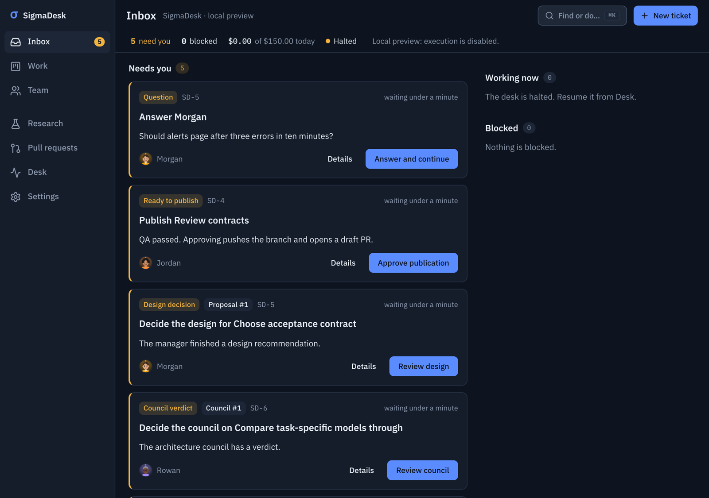
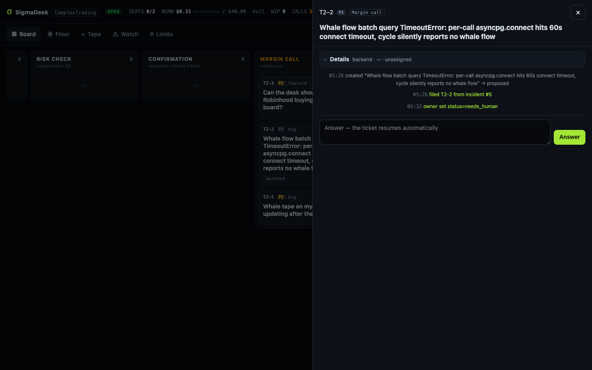
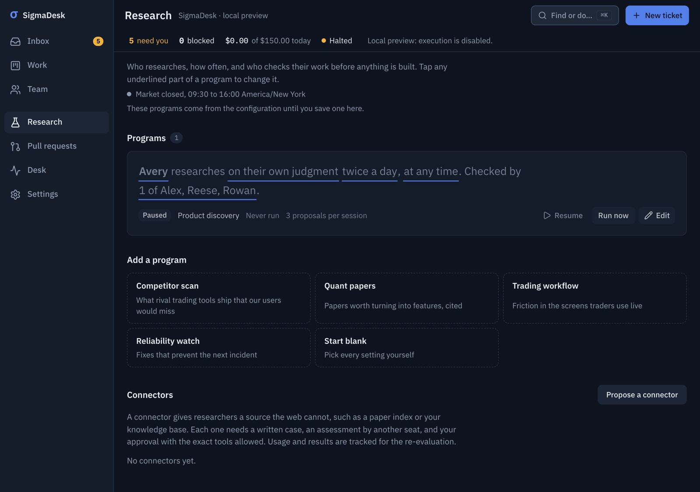
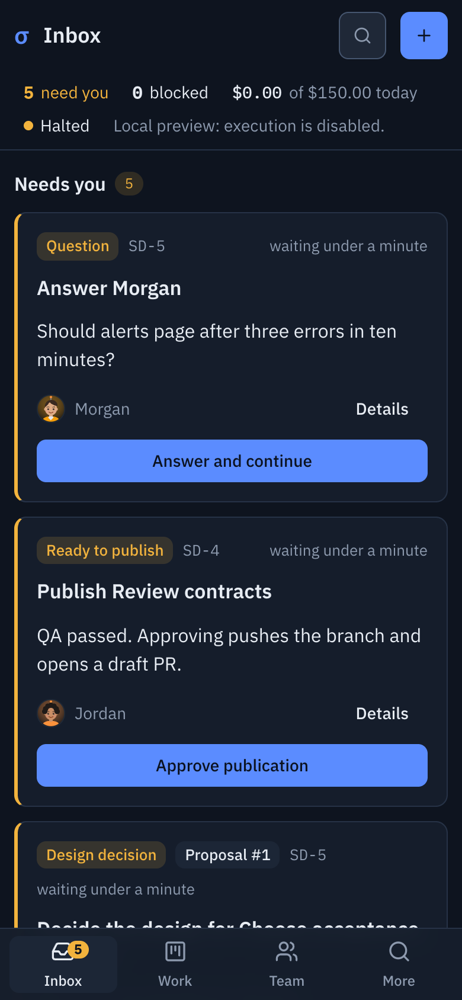
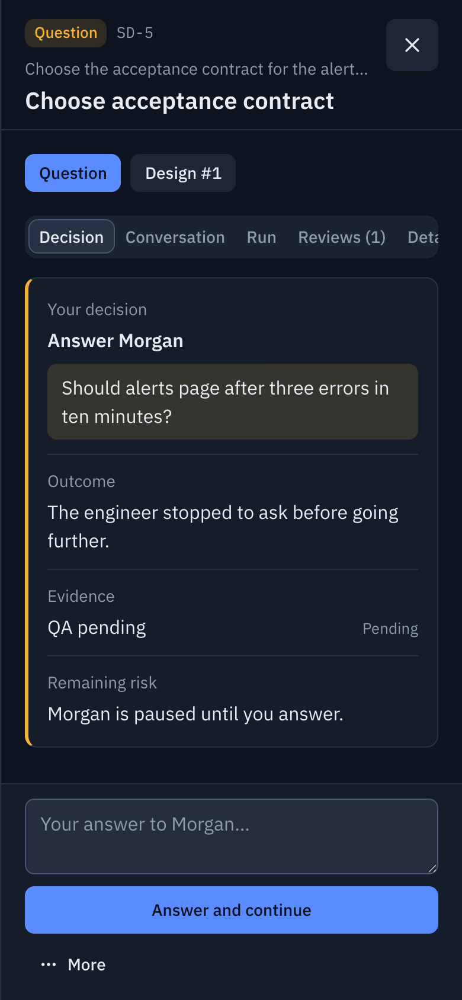

# σ SigmaDesk

**An AI engineering desk run like a quant firm.** Real Claude Code agents sit in real seats — a product manager who
researches competitors, an engineering manager who grooms and staffs work after huddling with principals, principal /
senior / junior engineers, a database engineer, an independent QA, an on-call SRE who reads your production logs, and a
support bot at the front door. You watch all of it live on a Jira-style board from your phone.

Small, risk-limited bets. Everything measured. Nothing ships without an independent risk check — and nothing merges
without you.

| Inbox | Decision panel | Research programs |
|---|---|---|
|  |  |  |

<p align="center"> </p>

## What it does

```
 you / GitHub issue ─► Support (triage) ─┐
 PM research (competitors, user pain) ───┼─► Manager grooms ◄─► huddle with principals
 SRE (new recurring error in prod logs) ─┘        │ (size S/M/L/XL, area, risk)
                                                  ▼
             routed seat: junior (S) · senior (M) · DBA (db) · principal (L/XL or high-risk)
                                                  │        └─► principal designs + slices into ≤4 S/M tasks
                                                  ▼            for seniors/juniors (principals never write code)
                                     own sandboxed clone, commits, `desk submit`
                                            QA risk check (pinned to the submitted commit)
                                                  ▼
                              Confirmation: the seat that asked for it checks it matches its intent
                                                  ▼
                                   branch pushed · draft PR · GitHub issue updated
                                                  ▼
                                              you merge
```

- **One real process per seat, any engine.** Each seat runs on an engine you choose — **Claude Code** (`claude -p`) or
  **Codex** (`codex exec`, OpenAI GPT models) — with its own model and reasoning effort. The desk detects what is
  installed, suggests a model per seat by capability tier (frontier for principals and the PM, fast/cheap for triage),
  and asks you to confirm the team before it first opens. A "mixed" preset puts QA and the SRE on a different vendor
  than the builders so reviews don't share the author's blind spots.
- **Live visibility.** Each run's `stream-json` is turned into human-readable activity ("Reading app/feeds.py",
  "$ pytest …", narration, todo-list progress) and pushed to the UI over SSE. The ticket view is a chat thread; the Floor
  shows every seat's desk, monitor and speech bubble; seats have presence (heads-down, in a meeting, reviewing).
- **Principals architect, others build.** Large or risky tickets go to a principal for a short read-only design run:
  the design is recorded on the ticket and the work is sliced into at most four S/M tasks for seniors and juniors
  (optionally ordered with `--after`). The parent becomes an epic whose progress rolls up from its slices. Frontier
  models spend tokens on decisions, cheaper models on typing.
- **Planning meetings are real.** The manager calls `desk consult principal-be "…"`, which runs the principal on the
  spot; the answer lands in the ticket thread for every later seat to read.
- **Two independent reviewers on every PR.** After QA passes, the draft PR is published and reviewed twice, in order, on
  the exact QA-passed commit: first by the principal who designed/sliced the work (else the Engineering Manager), then
  by an independent senior or principal who neither built nor designed it (preferably on another engine). Each
  approval says what was checked; change requests are numbered findings (file:line, why it matters, suggested fix).
  The author fixes (new commit → QA again → both approvals void) or pushes back with reasons (the same reviewer
  re-reviews). Every verdict and reply is posted on the PR in plain language. After two approvals the desk merges
  low-risk work itself (outside the busy window, CI green); anything high-risk or unclassified waits for you. After
  `review.maxRounds` change requests the owner gets a summary of the disagreement. Set `review.required: 0` for the
  older requester acceptance review instead.
- **A merge train, not a merge button.** PRs open as normal (non-draft) PRs (`github.draftPrs: false`). Approved PRs
  merge one at a time, oldest approval first, slices after their predecessor. Only high-risk work waits for you. A PR
  whose files trigger a deploying workflow (`deploy.workflows`: `"auto"` reads every workflow's `on.push`
  branches/paths filters, `!` exclusions included; or list the files that deploy — unreadable counts as deploying) is
  scheduled for the end of the busy window instead of merging during market hours ("Merges automatically at 4:15 PM
  ET"; Hold / Merge now from the PR page), and the next deploying merge waits until that merge's deploy run finished
  (failure or `deploy.waitMinutes` → you). Every minute the desk fetches the base and every open PR head and runs a free
  `git merge-tree`: only the queue front is rebased (desk-side, `--force-with-lease`, then QA plus a light reviewer
  re-confirm with a range-diff); a real conflict becomes a durable resolve job for the engineer who built the PR — a
  fresh, budget-capped run (`resolve.budgetUsd`, session resume off by default) in an isolated clone with a compact
  conflict pack — followed by QA and both reviewers re-confirming the resolution. Each step is posted on the PR.
  Merges fail closed: every merge (desk or owner) takes the deploy lock first when it redeploys, persists its intent
  before calling GitHub, and re-checks halt / stop-all / Hold / risk / window / lock / base freshness immediately before
  the merge call. The desk can only narrow the gap between "CI read" and "merged"; to make it atomic, protect the base
  branch with required status checks and "Require branches to be up to date before merging" (or a merge queue) —
  `npm run doctor` warns when that is missing.
- **On-call SRE.** A deterministic watcher (no LLM) tails Loki / docker / files, fingerprints errors, and wakes the SRE
  only for new or chronic signatures. The SRE files a root-caused bug, mutes noise, or pages you. Error storms become
  one page, not fifty tickets. A fixed signature that comes back reopens as a regression.
- **GitHub is the system of record.** Groomed tickets become issues with status/seat labels; comments mirror; QA-passed
  work becomes a draft PR that closes the issue on merge; merged PRs move tickets to Filled. Issues you label
  `sigmadesk` are imported (from trusted authors only).

## Engines

| | Claude Code | Codex (OpenAI) |
|---|---|---|
| How it runs | `claude -p --output-format stream-json` | `codex exec --json` with a desk-owned `CODEX_HOME` (apps, plugins, browser/computer use, hooks off) |
| Writes | own clone only (OS sandbox) | own clone only (Codex sandbox) |
| Network | blocked | blocked (permission profile) |
| Secret reads | **blocked** (`~/.ssh`, credentials, desk state) | **blocked** — reads denied outside system/toolchain paths and the clone (Codex permission profiles, beta) |
| Desk transport | per-run unix socket | per-run file mailbox inside the clone (symlink-safe) |
| Cost | USD per run, hard per-run cap (`--max-budget-usd`) | tokens; USD if you set `engines.codex.pricing`. **No per-run hard cap** — bounded by the run timeout and a reservation |
| Resume / fork | both | resume only |

The header and Reliability view show remaining provider usage, independent reset times and the effective route for
each engineer. Claude usage comes from CLI reports during runs. Codex account limits refresh every two minutes using
read-only app-server RPC, without a model turn. Unknown windows stay unknown. Perplexity desktop credits are dated
observed snapshots, separate from API billing; API balances are not fabricated. New runs switch to the other healthy
installed provider at `limits.planHoldAt` (80% by default). Settings → Automatic provider fallback controls this.
Saved seat preferences remain intact; credit/auth failures hold the provider instead of consuming ticket stall retries.
Cooldowns persist across restarts, weekly and five-hour resets are independent, and sessions resume only when provider,
model and seat contract match. Partial changes stay in the ticket clone and must be inspected by the next engineer.
Adding another execution engine means
implementing one file in `src/engines/` (`command()` + `parse()` → normalized events).

**Perplexity context packs.** A Perplexity-backed thinking seat (groom, design, consult, owner discussion, review,
research, triage, investigate) no longer relies on its local relay to pick what to send. `src/context.js` builds a
deterministic pack in the desk-owned bare repo (`data/publisher.git`), never from the seat's clone: the base is frozen
from the owner's remote (or the owner's checkout) and the review head is the desk-recorded `head_sha`, imported by object
id. Git runs with no system/global config, hooks, fsmonitor, signature checks, external diff or textconv. The pack
holds the frozen ticket and acceptance criteria, decision history, parent design, prerequisites and siblings, playbook
rules, protected paths, labelled excerpts and "references found by search" (text matches, not proven callers).
Reviews carry the committed diff in whole hunks; anything over budget is listed as omitted, and required content that
cannot fit refuses the run. One scrubber covers the whole pack and every served file (quoted JSON/YAML credentials,
private-key blocks, bearer tokens, URL credentials, known key formats); secret paths and both sides of secret renames
are withheld. Packs are stored in `data/context/` (0600). If a pack cannot be built within `prepareDeadlineSeconds`,
the run is refused.

The relay must send the pack verbatim. The desk inspects every outgoing call. It stops the run immediately and
invalidates it only for this run's exact token or verdict code, a validated private-key block, a recognised provider
secret (Anthropic/OpenAI/GitHub/AWS/Slack/Google/Stripe secret keys…, never public `pk_*` keys), a format listed in
`engines.perplexity.secretPatterns`, the value of a secret-named desk environment variable, or a message over
`contextMaxChars`. Generic credential-looking code (`token = getToken()`) is redacted from packs but never stops a run.
This is observation of the relay's stream, not a proxy: a violating message may already be in flight when the run is
stopped. The pack counts as delivered only when that call's tool result succeeds. Requested files
(`desk context-file <path> [--page N]`) are paginated without truncation; every page fits `pageChars` and pages may go
in several follow-ups, but they count only on the pack's own thread. `desk accept pass` is refused until the pack was
delivered, every omitted changed file was fully sent, no message to the thread is in flight, and `read_thread`'s
structured state shows the latest entry as `WORKFLOW_COMPLETED` after the last message (a later error or follow-up
undoes it). Stop-all also aborts runs that are still building their pack. A retry of the same job (same task, seat
contract and pack) resumes polling the recorded thread; anything else asks afresh. Knobs under `engines.perplexity`:
`contextMaxChars` (60000), `relayReserveChars` (8000), `remoteWaitMinutes` (8; idle watchdog and run timeouts are
raised above it), `followupRounds` (1), `pageRounds` (6), `pageChars` (0 = the pack budget), `secretPatterns` ([]),
`prepareDeadlineSeconds` (45), `maxRunMinutes` (90; the run timeout covers the first answer, follow-ups and page rounds, and
fewer page rounds are allowed when the cap is lower). Remote state is dated by when it was requested, so a `read_thread`
issued before a follow-up never counts as that follow-up's answer; if the pack thread fails, a replacement thread
carrying the pack takes over (coverage and completion start over on it).

## Owner decisions and discussions

Tickets awaiting you show **Approve**, **Needs correction** and **Reject** beside one message box. Approval continues
the pending task (or explicitly approves guarded draft publication); corrections require instructions and return work
to the engineer; rejection closes the ticket while retaining local work. Stale decisions are rejected. Draft approval
does not merge a PR: use **Review draft PR** for the final owner-controlled merge.

**Auto route** recognizes explicit requests to discuss with the manager/principals. These enter a durable read-only
discussion queue and preserve the implementation blocker. The manager restates intent, consults up to two principals
once each, and records a response on the same ticket. The composer also offers explicit discussion, answer and comment
destinations. Discussions cannot alter status, create tickets/issues, change code, merge or publish; they respect the
same provider, budget and concurrency gates. This follows the compact approve/edit/reject pattern in
[LangChain's human review interface](https://reference.langchain.com/javascript/langchain/browser/humanInTheLoopMiddleware).
Completed design proposals have their own decision target: approval/rejection records the design decision; corrections
queue a revised manager response. Those decisions preserve the underlying task state and its implementation/merge gates.

## Delegation: Morgan and Devon decide for you

Most owner decisions are routine. **Settings → Autonomy → Decisions made for you** sets, per kind of decision, who
decides:

- **You decide**: nothing runs; the decision waits for you.
- **Shadow** (the default for every kind): Morgan (EM) or Devon (SRE) decides, the decision is recorded and shown on your
  card ("Morgan would decide: …"), and you still decide. Compare for a while before switching a kind on.
- **Morgan decides / Devon decides**: the decision is applied for you, posted on the ticket as theirs ("decided for the
  owner"), and listed in the Inbox under **Decided for you** (last 24 hours) with **Override** (your decision replaces
  theirs, posted as yours) and **Reopen** (the decision comes back to you; nothing that already happened is undone).

| Kind | Delegate | What the delegate may do | Stays yours |
|---|---|---|---|
| Owner tasks | Morgan, by rule (no model run), the moment the task is filed | a step filed with `--owner-kind check` goes to Devon's probes; `--owner-kind package` becomes a package request on the ticket | writes, restarts, credentials, business decisions, any step filed without a kind, and any step Morgan filed |
| Engineers' questions | Morgan | answer a question its asker marked factual (`desk needs-human "<q>" --about factual`) on a positively low-risk ticket, under a standing rule you wrote | any other subject (money, credentials, product preference, trading semantics, schema effects) or none, high or unknown risk, stale evidence, a missing standing rule, Morgan's own question |
| Research-review holds | Morgan | send the proposal back with corrections or a narrower scope (once per proposal, for its whole life) | approving it past the reviewer's dissent |
| QA and review loop limits | Morgan | rescope, or reassign to another builder (once per ticket) | clearing a QA, CI or reviewer failure; a disagreement Morgan is a party to |
| Design and plan reviews | Morgan or Devon | approve or reject a recommendation on a positively low-risk ticket (a backend change can alter trading without any UI change) | a design the delegate wrote; council corrections (they queue a paid council) |

Never delegable in v1: budget, policies and this matrix; merges of high-risk work, revert merges and releasing holds;
publish-guard holds; standing and renewal production access; package installs.

- **Structured reasons only.** Every hold records why (`hold_kind`), who asked (`hold_seat`), what it refers to
  (`hold_ref`) and, for a question, what the asker says it is about (`hold_scope`, from `desk needs-human --about
  factual|money|credentials|product|trading|schema|other`); owner tasks record their kind (`desk create-task --owner
  "<why>" --owner-kind check|package|write|restart|credential|business|other`) and who filed them. Delegation never
  classifies message text.
- **One record per decision and evidence version** (`delegated_decisions`): the decision brief you see, the policy and
  delegation versions, the delegate, the actions it may take, attempts, spend and the outcome. The evidence version is
  one fingerprint of every column of the ticket, of every message on its thread and of the kind's own records (a
  proposal's reviews, a design's discussion, a council and its members), read as stored, plus the changed files. Only a
  short, explicit list of bookkeeping columns is left out (timestamps, progress, counters, the GitHub mirror), so a
  column added later counts as evidence by default: a new question, hold, message or revision is a new decision.
- **The authority is yours: you write the rules a delegate may apply.** Only the bullets under the playbook heading
  `## Standing rules the EM may apply alone` (configurable: `delegation.rulesSection`) count. You curate that section
  yourself; the desk and its seats never write it (the shipped playbooks and new projects start with it empty). The
  desk reads it strictly, as a small part of Markdown it can check line by line:
  - The heading is a `##` heading at the start of its line (not `#` or `###`, not underlined with `---` or `===`).
    Its words are matched ignoring case, extra spaces, a trailing `:` or `.` and closing `#`s, so
    `## standing rules the EM may apply alone:` opens the section too. It must be the first heading anywhere in the
    playbook with those words (compared by letters and digits only, at any level or underlined): a look-alike
    earlier, such as `# Standing rules…` or `## *Standing* rules…`, leaves you with no standing rules, and a second
    copy later never opens a section.
  - Each rule is a dash bullet (`- `) at the start of its line, right under the heading or under the rule before it.
  - A rule's conditions go on its bullet line, or on lines indented two spaces under it (sub-bullets included).
  - No code blocks, links, HTML or comments, numbered lists, lines indented four or more spaces, or other headings
    inside the section; and in a rule no `<`, `[` or `]`, no character reference such as `&amp;`, and no invisible
    character. The desk reads only what Markdown shows as written, so nothing in a rule can be hidden from you.

  Anything else ends the section where it stands, and nothing after it is read; a rule the line may still belong to
  is dropped, since it may be missing a condition. Settings tells you how many rules the desk found, so a count lower
  than you expect means a line ended the section early. The rest of the playbook must not leave Markdown room to
  read it differently either: anywhere in the file, a fenced block or comment it might end elsewhere (one opened
  inside a list item or quote, or four spaces in, counts as that), or any heading holding markup (`&`, `<`, `[`, `]`,
  `\`, a backtick) or a non-ASCII character leaves you with no standing rules, and Settings says which.
  **No HTML-like text anywhere.** A `<` right before a letter, `/`, `!` or `?` anywhere in the playbook (a tag such as
  `<div hidden>`, `<details>` or `<span style="display:none">`, an autolink such as `<https://example.com>`, or a
  placeholder such as `<paths>`) leaves you with no standing rules, and Settings says so. Raw HTML in the page
  Markdown writes can hide everything after it, the owner's heading and rules included, and the desk does not try to
  work out what HTML shows. This holds inside inline code too: the desk does not decode inline syntax, so
  `` `pytest <paths>` `` counts. Only text inside a fenced code block or an HTML comment block (a comment starting a
  line) is exempt; on a comment's closing line, whatever follows the comment counts again. So write placeholders
  spelled out (`pytest PATHS`, `desk fetch HTTPS-URL`), links bare (`https://example.com`), and any HTML example in
  a fenced block. A `<` before a space, a digit, `=` or `-` (`1 < 2`, `x <= 3`) is fine outside the section. The
  shipped playbooks follow this; a playbook written for an earlier version that mentions `<paths>`-style
  placeholders in prose must spell them out or fence them. With no such section, or an empty one, no decision run
  starts: nothing is decided for you by judgment. Owner-task triage is the one exception, because it is decided by
  rule, not judgment: a step filed as a check or a package is routed back to the team (when that kind is delegated)
  whatever the section says. Write narrow rules. The desk checks that a decision cites one of your rules and evidence
  from its brief; whether the rule fits the decision is the delegate's judgment, which you review in the Inbox.
  Override and Reopen let you decide again, but they cannot undo what the team already did after a decision.
- **Upgrading a playbook from an earlier version.** Earlier shipped playbooks and project templates put a note (an
  HTML comment) right under `## Standing rules the EM may apply alone`. A comment now ends the section, so with that
  note in place no rule after it counts and the desk finds none. Move the note above the heading (or delete it) and
  put your rules directly under the heading; Settings says so when it sees the old note there.
- **Decisions cite what they rest on.** A decision run is given your rules from that section, numbered (R1…), and
  numbered evidence (E1…: the ticket description, the kind's own record and the thread's messages), and answers with
  `desk decide answer|approve|changes|reject "<text>" --cite "R2,E1[,file:<path>:<line>]" --why "<how they settle
  it>"`. The desk checks every id against what that run was given; a decision must cite at least one rule and one
  numbered piece of evidence (a file may be cited too, never instead of an E). One that does not is not applied: it
  comes to you with its text as the recommendation. Any edit to your playbook while a decision runs invalidates it.
  File evidence is pinned: a run's read-only workspace is a copy of one trusted base commit, its file citations are
  checked at that commit, and if the desk's base has moved on by the time it decides, nothing is applied (the base is
  read, and the decision applied, under the lock the base's writers hold). That base is the desk's cached copy of your
  base branch, not a live read: it is refreshed when a read-only workspace is prepared, at most every 10 minutes from
  your remote (a checkout with no remote is read every time); when the remote cannot be reached it is your checkout's
  last fetched copy of the base branch, or your local base branch. Nothing is fetched when a decision is applied. A run that was stopped (cancelled,
  timed out, over its steps) never applies anything, even if its decision was already sent.
- **One bounded attempt.** A decision run reads the same brief and the thread (as untrusted data) and ends with one
  `desk decide` (or `desk decide escalate "<recommendation>" --why "<why it is yours>"`): up to $0.75 on an engine with a
  spending cap, or 6 minutes and 60 steps on a plan-billed one (`delegation.maxSteps`); an engine with neither is
  refused. A step is every command or tool call the engine reports, counted as it starts, and every desk request,
  counted apart: the desk never guesses which command sent a request, so **a desk command costs two steps**. Admission
  assumes the worst order of reports: a request is carried out only if the steps reported so far plus two for every
  request so far (this one included) fit, as if no command that sent a request had been reported yet. Otherwise it is
  refused and the run stopped before it can apply anything. That keeps room for the command behind each request, not
  for a plain command (one that sent no request) whose report arrives late: such a report can still take the run past
  its allowance after a decision applied, and stop it then. Stopping only takes away the run's authority; the decision
  it already applied stands. The same counting applies to tagged replies (`mentions.maxSteps`) and
  post-deploy checks (`watch.maxSteps`) on a plan-billed engine; admitted on an engine with a dollar cap, those are
  bounded by the dollars instead, and their steps are recorded but never stop them. A decision run keeps its own steps
  on either kind of engine. The bound is reserved for the engine the run
  actually gets (a fallback included). A research proposal's delegated runs share a $1.50 lifetime allowance: each run
  is capped at what is left of it, and an engine that cannot cap dollars only starts when its whole reservation fits.
  Every dollar is reserved or charged, never neither: a run's reservation stands, whatever its decision did, until the
  run's cost is charged, and after a restart every ended run is charged to its record. A run that ends without
  deciding, or a decision not started within 30 minutes, comes to you with the reason. Escalations carry a one-line
  recommendation, so your tap is yes or no. At most 40 decision runs a day; one slot stays free for QA and incidents.
- **Rules before the run and again at apply**, with no model call: a delegate never decides anything it is a party to.
  One list of interested seats serves every kind: whoever put the hold (the asker, the requester, QA, a disagreeing
  reviewer), built, is assigned, designed or worked on the ticket, reviews the change, wrote or reviewed the proposal,
  wrote the recommendation or chaired the council, or filed the owner task. Questions and designs only on positively
  low-risk tickets; lifetime limits that survive revisions. A decision is applied in one transaction after re-checking
  its evidence fingerprint, the delegation settings, the desk's general policy (production access, merge and sync
  settings) and the standing rules its run was given (your playbook); if any of them changed, nothing is applied.
- **Notices.** While a delegate holds a decision for you, the hold's push notice waits. It is owed on the hold itself,
  not on a version of the decision: when the decision comes back to you for any reason (an escalation, a failed run,
  a halted desk, a policy change, the kind switched to shadow or back to you, a hold no delegate may decide) you are
  told once, however its evidence changed in between. A decision the delegate applies is listed under Decided for you
  instead.
- **Escalate everything** (Settings) makes every decision yours at once and stops decisions in progress; so does any
  change to the matrix for the decisions in flight. `delegation.enabled: false` in the config (or
  `SIGMADESK_DELEGATION=off`) turns delegation off whatever is saved.
- **Peer access** (off by default): Morgan and Devon may grant each other production read access for one ticket, within
  your access policy. Renewals and standing grants stay yours.
- **Incidents.** From a log investigation Devon can hold every deploying merge and prepare an owner-only revert
  (`desk incident regression "<why>"`), and pages you at P0 when trading may be affected (`desk incident page "<why>"
  --trading`). Only you merge the revert and clear the hold.
- **What it saved.** `/api/state` (`meta.delegation`) and `GET /api/delegation` report, per kind over 7 days, the owner
  interventions avoided (each decision counted once; overrides and reopens excluded), escalations, shadow decisions and
  the spend; `GET /api/delegation/<id>` is the audit record with the brief it was based on.

## Architecture Review Board and model selection

Open a ticket → **Architecture review** → **Desktop / API review**. Choose a design reviewer and an independent challenger from a different model
family. Create the brief, then either run it through an API or copy it into Perplexity and attach the returned report.
In the Mac app, the model pill below the composer switches the next message's model; we verified Kimi K3, GLM 5.3
and Grok 4.7 in its Computer picker. Gemini availability differs by surface and requires the native Gemini API or a
compatible Perplexity API route here. A desktop subscription does not provide API credentials.

| Specialist | Starting model | Responsibility |
|---|---|---|
| Principal Architecture Reviewer | Kimi K3 | Alternatives, invariants, migration costs |
| Principal Systems & Frontend Reviewer | Gemini 3.1 Pro | Systems interactions, UX, accessibility |
| Staff Delivery & Efficiency Reviewer | GLM 5.3 | Complexity, implementation slices, cost |
| Principal Reliability Reviewer | Grok 4.7 | Failure modes, races, recovery |
| Product Discovery Researcher | Sonar | Cited public research |

These are task-specific starting choices, not measured claims of universal model superiority. Evaluate useful findings,
QA outcomes and cost on your own tickets. Gemini Flash and GLM Flash are offered for smaller reviews.
The software-company terms are **independent design review**, **Architecture Review Board**, **RFC**, and **ADR**.
The design owner resolves disagreements in an Architecture Decision Record. Advisory reports never grant QA approval.
Principals/managers can call `desk peer-review "<specific design question>"` once per run; missing credentials do not
block their design work. Reviews have no shell, desk token, repo access or merge permissions. Inputs are bounded and
redacted; only Sonar may use public web search. Daily reservations, concurrency, timeout and the circuit breaker apply.
USD charges without a provider cost report are estimates; reservations and token caps are not an upstream billing cap.

Configure `advisors.keyFile` to an owner-only, gitignored JSON file with `perplexity`, `gemini`, and/or `xai` keys.
Alternatively use `PERPLEXITY_API_KEY`, `GEMINI_API_KEY`/`GOOGLE_API_KEY`, or `XAI_API_KEY` in the service environment.
Credentials stay with the server and are stripped from engineer environments. Native Gemini/xAI routes are preferred;
Perplexity's Agent API routes the other model families. “Configured” means a key is present; authentication is checked on use.
Provider IDs and request formats were checked against [Perplexity](https://docs.perplexity.ai/docs/agent-api/models),
[Gemini](https://ai.google.dev/gemini-api/docs/models), and [xAI](https://docs.x.ai/developers/grok-4-7).

## Features: grooming with Codex, then your approval

A feature is something you want built, in your words. On the Features page, **New feature** asks for a name and what it
should do for whom. Morgan, the Engineering Manager, then runs a grooming round on **Codex**: a read-only run that reads the
repository and returns a plan with these parts:

- a two-sentence summary;
- the goal and who it is for;
- what is in and out of scope;
- testable acceptance criteria;
- risks;
- questions only you can answer;
- one to eight small or medium tasks in build order.

The feature's page shows that plan as a document, with the grooming session beside it:

- **Reply to Codex** to start another round. The previous plan and your note go into the prompt, and earlier rounds stay
  readable.
- **Edit the tasks** before approving: rename, resize or switch off any of them. A task that depends on another needs both.
- **Approve** to create the tasks with their order enforced. Each task brief carries the feature's goal and criteria. The
  feature moves to building and closes itself when its tasks are settled.

Nothing starts before approval. A feature with a plan in progress is held from triage, ordinary grooming and
implementation. An approved plan is the plan gate, so no separate product review is needed. QA, code review and your
merge approval still apply.

With GitHub sync on, an approved feature and its tasks get issues. The feature's issue carries the plan and a task
checklist that ticks as tasks merge. GitHub mirrors the desk; decisions happen on the desk. An issue you wrote yourself
keeps your text, and the desk adds its section between markers. Approved features are reconciled with GitHub on every
start.

Ordinary grooming also runs on Codex by default (Settings → Grooming can switch back to Morgan's own engine). When Morgan
splits a ticket, `desk split` keeps the parent open as an epic that closes when its tasks are done, and `--after` records
the order between tasks. You can change a task's order in its Details tab, and reopen a parent that was closed while its
tasks were open.

**Epics and tasks are linked both ways.**
- **Every task names its epic.** Inbox cards, Work cards, pull requests and the ticket panel show "Part of: Feature ›
  Sub-epic" crumbs, and each crumb opens that epic.
- **Every epic shows its tasks.** An epic's panel opens on a Tasks tab with the full tree, what each task waits for,
  and progress counted over the real work.
- **Work can be grouped by epic.** Work → By epic shows each top-level epic with its whole tree, then anything not in an
  epic.

## Research programs and the second-person review

Research is configured as **programs** (Settings → Research): which seat researches, how often, whether only during or
only outside market hours (`research.marketHours`, New York regular hours by default), which approved sources it must
cite, whether it may use the web, which approved connectors it may call, how many proposals a session may file, and
which seats must review a proposal. The default `product-discovery` program is the PM's competitor research and is
derived from `pm.*` and the legacy cadence settings until you save programs. Due programs run oldest-first while the
funnel is thin; "Run now" skips cadence and window but never budget, capacity, engine fit or the proposal allowance.

Every proposal filed by a research run waits for an **independent second review** by a different seat (preferring a
different model family) before the manager may groom it: `pass` unblocks it, `changes` gives the author one bounded
revision, `reject` or a second `changes` holds it for you (approve, send back with notes, or reject). Reviewers run
read-only and answer with a structured verdict; you can waive the review, and that is recorded.

**Connectors** (MCP servers for research seats) are governed: a written case (benefit, how it is used, SDLC stage,
cost, time, data leaving the machine, risks, success measure), an independent assessment by a seat other than the
proposer, then your approval with the exact binding and tool list and a re-evaluation date. Usage, cost and the review
outcome of the proposals they helped produce are shown per connector. A `stdio` connector runs outside the OS sandbox
with your user's file access; the desk strips its own credentials from that process and allows only the listed tools,
but cannot confine it, so prefer `https` bindings. See [docs/research-programs.md](docs/research-programs.md).

## On-demand engineering councils

Open **Architecture review** → **Model council**. Choose two or three reviewers from different model families,
their lenses, and a principal synthesis model. The manager may choose approved models with `desk council-models`
and `desk council --profile data --reviewer codex/default --challenger claude/sonnet "<decision>"`, once per run.
The domain principal chairs the decision; the coordinator checks provider readiness, budget and capacity.

Each independent reviewer sees the identical frozen, redacted ticket specification, design notes, constraints and
candidate SHA. Reviewers cannot use tools or inspect a changing checkout. Supply code evidence in the brief when
needed; a design council does not perform implementation QA. Individual JSON findings, evidence and exposing tests
are retained. An optional single blinded challenge runs when verdicts disagree. The chair weighs evidence and keeps
unresolved dissent. **Approve / Needs correction / Reject** records the design decision; corrections queue a fresh
council with the message. Partial or stale reports cannot be approved. These records remain in the local desk.

All planned calls, including challenge and synthesis, reserve their individual caps (maximum $20 per council).
At most two calls run at once and one capacity slot is preserved for QA/SRE. A failed reviewer does not discard the
others. **Retry failed calls** reuses completed first judgments on the same input and runs a fresh synthesis. An
interrupted paid call needs an explicit retry. Never-started queued work survives restart. Changed specification,
dependency, branch or SHA invalidates the brief. Pausing or the circuit breaker cancels councils and retains reports.

CLI councils use existing Claude/Codex authentication headlessly. Gemini, xAI, Kimi and GLM use the separately
configured advisor APIs. The separately installed Perplexity thinking-seat relay has its own provider connectivity status. Computer councils are off by default (`engines.perplexity.councilEnabled: false`): a Computer task bills account credits and cannot be cancelled from the desk. Once the guide has been completed on your account, set the flag and Perplexity models (Kimi, Grok, DeepSeek, GPT and Claude families; the cheap tier stays out) join the reviewer pool as their own model families, with `remoteWaitMinutes` added to the council call timeout. To verify Computer OAuth, follow
[the connection verification guide](docs/perplexity-connection.md). Its native Model Council MCP interface, live
balance and remote cancellation remain unverified; the desktop snapshot does not establish server connectivity.

Automatic council triggers are disabled. Run `node scripts/evaluate-council.mjs --real` for an isolated, opt-in
comparison of single, sequential and parallel review against two defect fixtures and a clean control. The first pilot
matched all three expected judgments for each strategy, with 3/6/9 calls respectively. It did not establish an accuracy
advantage for councils. Codex USD is a conservative estimate when no provider cost is reported, not subscription credits.

## Background reliability and local checks

The launchd user service, CLI engineers and deterministic watcher continue when the screen is locked. On macOS,
`server.preventIdleSleep: true` holds `caffeinate -i -w <desk PID>` while the desk runs. It does not prevent screen lock,
lid-close sleep, explicit sleep, low-battery sleep, shutdown or logout. User LaunchAgents end at logout. Desktop clicks
require an unlocked session; API reviews are independent of it. Interrupted runs are charged conservatively and their
tickets return to the queue on restart. Setup errors back off from one minute to fifteen rather than retrying every tick.

Reliability shows source health, stale polls, provider holds, scheduler liveness, headroom and queue reasons. Watcher
cursors and incidents commit atomically; rolled-back events never reach the UI. Each read-only seat has its own scratch
clone. Mailbox replies create their private staging directory, retain completed responses on I/O failures, and retry
without executing the action twice. Use `scripts/restart-when-idle.sh <service-name>` to drain and restart between runs.

`npm test` runs the regressions and isolated HTTP tests. `npm run preview` starts a disposable UI fixture on port 8791
with every execution seat disabled and no publishing, notifications or credentials. `node scripts/smoke-seat.mjs`
explicitly spends a bounded real Codex run on a disposable repo to verify quota fallback, mailbox, denied reads/writes
outside the clone and blocked network. It retains private diagnostics on failure.

## Safety model (read this)

Agents run on your machine, so SigmaDesk treats them as untrusted:

| Layer | What it does |
|---|---|
| **OS sandbox** | Every agent shell runs inside Claude Code's sandbox (Seatbelt on macOS, bubblewrap on Linux) with `allowUnsandboxedCommands: false`: writes only inside the seat's own clone, **no network** (empty allowlist), `~/.ssh`, `~/.aws`, `gh` credentials and your repo's `.env` unreadable. Python/node subprocesses inherit it. |
| **One narrow door per run** | Each run gets its own unix socket, allowlisted only in that run's sandbox and bound to that run: a token copied from elsewhere is useless. Commands are role- and ticket-checked (an engineer cannot pass its own QA; support can only route the ticket it was given). The owner UI is a separate TCP listener agents cannot reach. |
| **Desk state is invisible** | The desk database, config, private notes and every seat's session transcripts (`~/.claude`, `~/.codex`) are unreadable from agent shells. |
| **Scoped file tools** | Claude's `Edit`/`Write` run outside the Bash sandbox, so they are allowed only under the seat's own clone. Web tools (also outside the sandbox) exist only for the PM's research. |
| **Verdicts can't be forged by code** | QA and acceptance verdicts need a one-time code that lives only in the reviewer's prompt — tests written by the engineer (which QA executes) cannot read it (they can still post comments with the run's token). QA may only pass after its own run executed a test command — one that starts a shell segment — successfully. |
| **No inherited config** | `--setting-sources ''` (none of your hooks/plugins), `--strict-mcp-config` (no MCP servers), `--tools` limits the toolset, deny rules for `git push`, `gh`, `docker`, `curl`, …; agent shells use plain `bash` (no personal aliases). The desk refuses to start if `claude` resolves to a wrapper script that adds permission bypasses. |
| **Isolated clones** | Each ticket gets its own `--no-hardlinks` clone (no shared `.git`, hooks or object files with your checkout). Read-only seats get a scratch copy that is deleted and copied fresh from a desk-owned template on every use (never reused or written through). Clones are deleted when the ticket closes. Before any workspace is deleted or handed out its path is resolved: only real directories directly inside the workspaces root, never a link and never the desk's data. |
| **Process groups** | Every run is its own process group. Stopping a run (owner, idle watchdog, timeout, circuit breaker) ends that group: SIGTERM, then SIGKILL after a grace period, sent only while that same group still has members and never to a group that now belongs to another run, to pgid 1 or to the desk's own group. After a restart, a recorded pid is signalled only if its start time proves it is the same process. **Residual limitation:** a run that ends on its own does not reap processes it left behind, and macOS has no cgroups, so a detached (`setsid`) process can outlive its run. It keeps the run's sandbox: it can write only inside that seat's own workspace (not the workspaces folder, not the desk's data). It can delete or replace entries inside its workspace (even the workspace entry itself); the desk never writes through a link there (every component is checked, files are opened with `O_NOFOLLOW`) and refuses a workspace that is not a real directory. |
| **Tagged runs** | A seat tagged in a ticket conversation runs read-only (no file or `.git` writes, in both engines), with a hard per-tag bound: a dollar cap on Claude, or time and steps on a plan-billed engine (Codex); metered engines without a cap are refused. The bound is cumulative across retries. |
| **Publisher, not agents** | Only the desk pushes, and only the exact commit QA approved. It fetches that commit into a desk-owned bare repo and pushes from there to your remote, so no git command ever runs with an agent clone's config or hooks. PRs are always drafts. Nothing is ever merged automatically. |
| **Publish guard** | Computed in the publisher against *your* checkout's base commit (an agent cannot move it). Branches touching CI/workflows, Dockerfiles/compose, git hooks, lockfiles or shell scripts — or bigger than the size cap for their complexity — are parked for your explicit approval. An agent-edited workflow would otherwise run on your CI runners with repo secrets. |
| **Risk limits** | Per-run budget caps (Claude), a daily limit that reserves every working seat's cap (including jobs still preparing), runs without a final cost report charged at their cap, max concurrency, a quieter "busy window" (e.g. market hours), an idle watchdog, a halt switch and a circuit breaker that also cancels jobs still preparing. |
| **Explicit agent environment** | Agent processes get an allowlisted environment (PATH, locale, terminal, temp dir, HOME/USER, `SHELL=/bin/bash`, proxy/CA settings, the run's desk token/socket/mailbox, the engine's own auth variables) — never your shell's `DATABASE_URL`, `*_DSN`, broker or cloud keys. |
| **Untrusted text** | Ticket bodies, issue bodies, web pages and log lines are fenced and labelled as untrusted data in prompts. Secrets are redacted from the activity log. |

It is still your machine: read the playbook rules, keep `sandbox.enabled: true`, and review every PR. The design has
been through two adversarial reviews (findings and fixes are in the commit history); treat it as defence in depth, not
a guarantee — Codex permission profiles are a beta feature, and anything you add to `readOnlyPaths` is readable by
every seat.

## Production read access (`desk ops`)

Off by default. When the owner switches it on, a seat that holds a **grant** can ask the desk to run a small set of
**named, read-only probes** against production. The seat never sees a credential, never gets a shell on the host and
never writes SQL or URLs: the desk validates every parameter against a fixed schema, runs a fixed template itself, and
hands back a redacted, byte-capped result labelled as untrusted data.

| Probe | What the desk runs |
|---|---|
| `db_health --db NAME` | `pg_stat_activity` grouped by state/application, the 10 longest-running sessions (no query text), `pg_locks` summary, top dead-tuple tables, `pg_stat_replication`, `pg_stat_database` |
| `ingest_freshness [--db NAME] [--minutes N]` | `SELECT … FROM sigmadesk_ops.ingest_freshness(N)`: a SECURITY DEFINER function (created by `scripts/provision-role.sql`, owned by a NOLOGIN role) whose fixed queries take `max(<time column>)` per approved table with a half-open window `col >= now() - N min AND col < now() + 5 min`; the read-only role holds no grant on any hypertable |
| `timescale_jobs [--db NAME]` | `timescaledb_information.jobs` ⋈ `job_stats`, `continuous_aggregates`, last 24 h of `job_errors` |
| `container_status` | `docker ps -a`, `docker inspect` with a fixed format (health, restarts, start, OOM — never env), `docker stats --no-stream`, allowlisted containers only |
| `container_logs --container C [--since 30m] [--grep TEXT] [--tail N]` | `docker logs --timestamps --since … --tail …` on one allowlisted container; literal filter; byte-capped streaming |
| `app_health` | one GET of the configured base URL's `/health`, 5 s total deadline, 64 KB cap; redirects are not followed. Diagnostics that make the app query its own database (e.g. `/diag/cache/quality`) are deliberately not offered: they would bypass the DB lane, the read-only wrapper and cancellation |

Every DB probe runs as `BEGIN READ ONLY; SET LOCAL statement_timeout / lock_timeout / idle_in_transaction_session_timeout /
work_mem / temp_file_limit / max_parallel_workers_per_gather = 0; …; ROLLBACK;` through the host `psql` with parameters
passed as psql variables (never interpolated). One DB probe runs at a time (bounded queue), results are cached for 60 s,
budgets apply per run and per hour, and the busy window (market hours) tightens timeouts, budgets, log windows and
limits `ingest_freshness` to the last 2 h. Probes are cancelled when their run ends, when access is revoked, and when you
switch the setting off. Every call lands in the `ops_audit` table and as a line on the ticket ("Devon checked ingest
freshness — 0.4s").

**Grants.** Who may probe is decided per grant: a seat, the probes it covers, and an end — a time, a ticket (ends when the
ticket closes) or a run. A seat asks with `desk ops request <probe…> --why "…" [--for 1h | --ticket]`; the Engineering
Manager or the SRE (whichever is not asking) approves within your policy (allowed seats, probes, longest duration, active
grants — Settings → Production read access → Production access), never for themselves. Anything beyond the policy is
an Inbox card for you ("Grant Devon production read access for 2h?"). You can grant anything (including standing
grants), revoke any grant, or **Revoke all**. Access for an approver seat (EM, SRE) and renewals (a seat that has or just
had access) are always yours to decide. A ticket-scoped grant is dormant until that seat's run starts work on the ticket,
then lives only while that run is live and the ticket is in progress or in review. Validity is checked at every probe call,
every running probe is re-checked on its own (at its grant's expiry instant and every 2 s), and every way a grant ends —
revocation, expiry, ticket or run end, Revoke all, the switch — cancels the probes it authorized, even while the desk is
halted. A `desk verify done` needs at least one successful probe in that run.

**Seat environments.** Seats get an allowlisted environment (no inherited `DATABASE_URL`, DSNs or keys), and their tool
shells get an isolated per-run HOME (no dotfiles, histories or credential stores; a `.gitconfig` that includes yours).
Claude keeps its real HOME for its own login and session transcripts and switches tool shells through
`CLAUDE_ENV_FILE` (sourced before every Bash command, which also unsets its auth variables; verified with Claude Code
2.1.288). Codex authenticates from its desk-owned `CODEX_HOME`, so it runs with the isolated HOME directly.

Reads are allowlisted, not enumerated. For Claude seats the sandbox denies the **whole home folder** to shell commands and
re-opens only: the seat's clone (and any read-only trees it was given: `project.readOnlyPaths`, review snapshots), the
desk's `bin/`, the run's socket, toolchains and caches (`~/.local/share/mise`, `~/.local/bin`, `~/.nvm`, `~/.volta`,
`~/.fnm`, `~/.pyenv`, `~/.rustup`, `~/.cargo/{bin,registry}`, `~/.bun/bin`, `~/.deno/bin`, `~/go/{bin,pkg/mod}`, pip/uv
and Playwright caches), `~/.gitconfig` and `~/.config/git` (add more with `sandbox.allowRead`); file tools may read only
inside the working directory and those trees (`blockReadsOutsideWorkingDirectories`). Codex seats read only system and
toolchain paths, `~/.gitconfig`, read-only paths and their clone. For both engines, secret-looking files inside readable
trees stay unreadable (`.env*`, `.envrc`, `*.pem`, `*.key`, `*.p12`, `*.pfx`, keystores, SSH keys, `credentials`,
`*credentials*.json`, service-account JSON, `.npmrc`, `.pypirc`, `.netrc`, `.pgpass*`, `.git-credentials`, `secrets.{yml,yaml,json}`),
as do the desk's state, credential stores and pgpass/service/verifier files. Still reachable: everything outside the
home folder that the OS lets any user read (system files, `/opt/homebrew`, `/tmp`), the toolchain trees above, and the
seat's own clone — keep secrets out of the repository and out of `readOnlyPaths`. `project.env` entries must be
plain names and values: anything that looks like a credential (URL with a password, DSN, key, token) is withheld. A manager task that only needs a
production *read* (`desk create-task --verify`) goes to the SRE, who answers it with probes under a ticket-scoped grant;
it comes to you only if no probe can answer it. An `--owner` step is yours: the desk never reads its text to reroute it,
and only delegation's owner-task triage can hand a stated `--owner-kind check` back to the SRE.

**Setup (owner, once):**
1. Provision the read-only role on each database — **dry run first** (does everything, self-checks the function as
   `sigmadesk_ro`, then rolls back):
   `psql -X -U postgres -h 127.0.0.1 -p 5433 -d trading_ts -v ON_ERROR_STOP=1 -v dry_run=1 -f scripts/provision-role.sql`,
   then the same without `-v dry_run=1`, and again for the app database (`-p 5434 -d trading_app`); then
   `\password sigmadesk_ro`. `sigmadesk_ro` gets session statistics, CONNECT, the Timescale job views and EXECUTE on
   `sigmadesk_ops.ingest_freshness(int)` — no grant on any hypertable (column grants fail on compressed hypertables).
   The function's owner, NOLOGIN `sigmadesk_ops_owner`, holds table-level SELECT on the approved tables, which Timescale
   propagates to every chunk (~2,400 chunks: seconds to a few tens of seconds). One transaction with `lock_timeout 2s` /
   `statement_timeout 120s`; it prints the PostgreSQL and TimescaleDB versions, never touches PUBLIC (except on its own
   schema and function) or other roles, aborts without changes if either role or the schema already holds anything
   beyond the reviewed set, and is safe to re-run. `scripts/audit-public-functions.sql` is a separate, optional,
   read-only report.
2. Put the password in a pgpass file only the desk reads (`chmod 600 ~/.pgpass-sigmadesk`); the sandbox denies it to seats.
3. Configure the desk (`sigmadesk.config.json`):
   ```json
   "ops": {
     "enabled": true,
     "psql": "/opt/homebrew/opt/libpq/bin/psql",
     "pgpassFile": "~/.pgpass-sigmadesk",
     "databases": {
       "timescale": { "host": "127.0.0.1", "port": 5433, "dbname": "trading_ts", "user": "sigmadesk_ro" },
       "app": { "host": "127.0.0.1", "port": 5434, "dbname": "trading_app", "user": "sigmadesk_ro" }
     },
     "freshness": [
       { "label": "bar_ticks 1s", "db": "timescale" }, { "label": "bar_ticks_1s", "db": "timescale" },
       { "label": "whale_trades", "db": "timescale" }, { "label": "bars_1m", "db": "timescale" }
     ],
     "containers": ["alpaca-trader", "precompute-worker", "stock-ingestor", "options-whale-ingestor", "timescaledb", "app-postgres"],
     "appHealth": { "baseUrl": "http://127.0.0.1:8001" }
   }
   ```
   `ops.psql` must be a host psql binary (a path, or `[path, fixed args]`). Wrappers that reach into a container or a
   shell (`docker exec … psql`, `ssh`, `bash -c`) are refused: credentials stay in your pgpass/service file, and the
   desk passes psql an environment without any inherited `PG*` variables. Passwords in the config are refused.
4. Restart the desk, turn on **Settings → Production read access**, and grant (or let the EM approve) access as needed.

## Packages and documentation without network (`desk pkg`, `desk fetch`)

Seats still have **no network**: no egress allowlist is opened for any engine (Claude `allowedDomains` stays empty,
every Codex permission profile keeps `network.enabled = false`). Two narrow desk-run doors cover what seats need:

- **Python packages, owner-approved, per ticket.** A build run asks with exact pins:
  `desk pkg request name==version [...] --why "…" [--dev]` (canonical names; extras, markers, URLs, ranges and pip
  options are refused), within budgets for unapproved sets (per run, per seat, in total, staged MB, a TTL). The *desk*
  resolves the whole set with the shared venv's interpreter and pip started with no startup hooks (`-I -S`), wheels
  only, `--index-url https://pypi.org/simple` only, in a scrubbed environment (no `PIP_*` or proxy settings from your shell,
  `PIP_CONFIG_FILE=/dev/null`, temp cwd and HOME, hard time and disk limits), and all of its traffic goes through a
  desk proxy that lives for that resolution only: CONNECT to `pypi.org:443` and `files.pythonhosted.org:443` and
  nothing else, with a per-resolution token, one aggregate byte budget over every tunnel (spent = all tunnels closed, new
  CONNECTs refused, the resolution failed) and a time cap. The constraints are the complete ticket
  lock — the shared venv's distributions read statically from their METADATA, plus what was already approved for the
  ticket — so nothing existing changes version. pip's answer is only a proposal: the desk downloads every wheel itself
  from `files.pythonhosted.org` (one deadline across DNS/headers/body, redirects re-checked, size caps), binds it to the
  sha256, and checks its RECORD file by file; that inventory is what the installed venv is later verified against. The set is staged under `data/pkg/<id>/`. Your Inbox shows a **Package install** card with
  the requester, ticket, reason and every wheel (transitive ones too) with its version, size and sha256; only you
  approve (Access sheet: approve, decline, revoke). No probe grant, owner tag or post-deploy grant covers packages.
- **Offline install inside the sandbox.** Runs of that seat on that ticket started after the approval can read that
  stage (Claude `allowRead`, a per-run Codex profile override) and nothing else new. `desk pkg install` runs
  `python -m venv --without-pip .venv` on the shared interpreter, layers the shared venv's site-packages read-only
  through a `.pth` file (not `--system-site-packages`), and installs with
  `pip install --no-index --no-deps --require-hashes --find-links <stage>` using pip from a wheel in the stage, with
  `PYTHONDONTWRITEBYTECODE=1` and a desk-owned CA bundle copy (`data/pkg/ca.pem`). The desk then reads the venv back
  (never executing it): interpreter identity, every installed file hashed against the approved inventories, no
  unexpected file, `.pth`, `sitecustomize` or bytecode, the shared venv unchanged; that fingerprint is recorded on the
  ticket. With a `.venv`, QA passes only through `desk test pytest|unittest …` (the canonical interpreter; arguments by allowlist — paths
  or node ids in the workspace, `-k`, `-m`, `-x`, `-q`, `-v`, `--maxfail=N`; the desk adds `-p no:cacheprovider`, `-n 0`
  with xdist and its own `--junitxml`, and drops `PYTEST_ADDOPTS`/`PYTEST_PLUGINS`; the real exit status and pytest's
  junit report or unittest's summary — at least one test run, none failing — recorded with the fingerprint and the
  commit). Once anything is approved for a ticket, its tests count only in a verified, complete `.venv`: nothing under
  the venv root may differ from the wheels' RECORDs, pip's exact console-script wrappers and the venv's own interpreter
  shebang; the merge brief says "adds N
  dependencies (runtime/dev)", and reviewers are asked to check the requirements file change. Revoking, expiry
  (`packages.grantHours`) or the ticket closing deletes the stage and refuses further installs; the workspace venv dies
  with the workspace. The shared venv is never written.
- **Documentation.** `desk fetch <https-url>` makes the *desk* fetch one page from `fetch.hosts` (default
  `docs.python.org`, `nodejs.org`, `docs.github.com`; edit it in the config): HTTPS only, exact host names checked
  before DNS, IP literals and private/link-local addresses refused, every redirect re-validated, size and time caps.
  HTML comes back as plain text marked untrusted, and every fetch is an event on the ticket.

## Post-deploy watch: does the change work in production?

A merge is not a deploy, and a deploy is not a verified change. After every deploying merge the desk records the
deploy and then checks production itself.

- **Deploy history.** One row per deploy workflow run of a merge commit: workflow, run id, **run attempt**, target,
  status, completion time and source (`desk`, `owner` or `external`). It is written in the same transaction that
  releases (or holds) the merge train's deploy lock, so a crash never leaves a released lock without its record and its
  watch. A failed or never-confirmed deploy stays `failed`/`unknown` in the history even after you clear the hold.
  Every ~10 minutes the desk also compares GitHub's recent runs of the deploying workflows with the history: a re-run
  (a new attempt), a manual `workflow_dispatch` or a push it missed becomes an `external` deployment, and a run the
  history holds as `unknown` (an escalated or owner-cleared hold) gets its late result — a late success is watched,
  while the hold's own record (`hold_status`, `cleared_by`) stays as it was. If recording a finished deploy fails, the
  lock is escalated for you to clear, never left "running". Deploy monitoring runs on its own minute timer, whether or
  not the merge train or reviews are on.
- **Targets.** `deploy.targets` names what each deploying workflow redeploys, e.g.
  `{"deploy-mac-mini.yml": "alpaca-trader"}`, and `deployWatch.targetContainers` which allowlisted containers belong to
  a target (default: the container named like the target). Deployments are compared by the concrete **resources** their targets stand for (containers via
  `deployWatch.targetContainers`, databases via `deployWatch.targetDatabases`), never by label: blue and green that
  both run the `trader` container share it. A newer deployment retires exactly the shared resources from older watches,
  per component: an ingestor-only deployment retires just the ingestor part of a trader+ingestor
  watch, and the trader keeps being checked; an unmapped deployment never cancels another watch and is itself watched to the end. An older
  deployment discovered after a newer one of the same target is recorded as superseded at once (per-target watermark).
- **Checkpoints.** T+5 min (smoke), T+30 min, and the **next exchange session open + 5 min**. The calendar is a small
  built-in NYSE table for 2026–2027 (holidays, 13:00 early closes, regular session 09:30–16:00 America/New_York, DST
  through the time zone database). Extend or replace it with `deployWatch.calendar`:
  `{"holidays": ["2028-01-17"], "earlyCloses": {"2028-11-24": "13:00"}, "replace": false}`. A year outside the table
  **fails closed**: the session-open check is marked unschedulable and goes to your Inbox (retry after fixing the
  calendar, choose a time, or skip it — then the deployment cannot be fully verified). List covered years with
  `deployWatch.calendar.years`; a bad override is reported at startup.
- **Baselines.** Just before a deploying merge the desk reads production (container restarts, start times and images,
  error signatures in the last 30 minutes of logs, ingest freshness). The baseline is only trusted when it finished
  before the deploy run started and is at most `deployWatch.baselineMaxAgeMinutes` old; otherwise the evidence says so.
- **Deterministic checks first.** At each checkpoint the desk runs fresh read-only probes itself (never cached): app
  `/health` (**HTTP 5xx = unhealthy**, whatever the probe's own outcome), container state/health/restarts against the
  baseline, error signatures as **normalized per-minute rates** over two bounded windows (30 min before the merge, and
  since the deploy; a known signature counts when its rate rises `deployWatch.signatureRateRatio`×, default 3), and
  ingest freshness (stale while the market is closed is not judged; only a trusted baseline that was already stale
  excuses it). Required checks come first; then each watched container's logs and each freshness database
  — the ones not yet read (fresh within 15 min) first, logs before freshness — so a small market-hours allowance
  (`deployWatch.probesPerCheckpoint`, default the per-run limit) covers everything across retries, and an allowance
  that never can ends inconclusive naming exactly what was never read; the desk's own probes
  leave `deployWatch.sreReserveProbes` of the hourly budget for the SRE. Each checkpoint stores structured evidence:
  criterion, probe, observation time, threshold, observed value, result, coverage limits, and the deployment identity
  (workflow runs, container images, and the commit the app reports on `/health` when it does). **Verified needs the deployment identity to match** (the app reports
  this commit on `/health`, or a container image is tagged with it) and healthy evidence for every required check; any
  unhealthy answer vetoes it, and partial coverage is inconclusive. The first hard failure immediately places a
  **provisional hold** on deploying merges and pages you; one more look a couple of minutes later confirms it (only a fresh
  passing look at the very checks that failed lifts the provisional hold; a confirmation the budget refused keeps it);
  an SRE "verified" is accepted only after the desk's own fresh look gives every required criterion healthy evidence
  and each anomaly was re-checked with its own probe; a check that observed nothing is retried
  (`deployWatch.retryMinutes`), then inconclusive. A check missed by more than `deployWatch.missedHours` is recorded as
  missed. During market hours the probe allowance per checkpoint is the busy-window per-run limit.
- **Evidence identity.** Every piece of evidence is keyed by `{criterion, kind, resource}` (probe kind and the exact
  container, database or endpoint it observed; audited probe calls record what they observed). Settling an anomaly,
  accepting "verified", the provisional hold's failure set and its release, and coverage gaps all match on that key: a
  trader-scoped status never settles the broker, and database A's failure is released only by a healthy read of A.
- **The SRE model only when needed.** Anomalies (one restart, a new error signature below
  `deployWatch.newSignatureMinCount`, a 3xx/4xx health answer) and the ticket's own criteria (at T+30, and at the
  session open for trading-path work) go to the SRE in a capped `watch` run: `watch.budgetUsd` (default $1) per
  checkpoint across attempts on a capped engine, or `watch.maxMinutes`/`watch.maxSteps` on a plan-billed one. "Verified"
  from the SRE needs a fresh probe in that run. Watch and verify runs never publish or merge anything; a watch run cannot even comment.
- **Access.** `access.policy.postDeployAutoGrant` is **off** by default (also for desks saved before it existed). When
  you switch it on (Access sheet), a checkpoint's SRE run gets a grant bound to that run and checkpoint, within the policy (allowed seats, probes,
  longest duration, active grants), limited to the deployment's containers and databases — derived live from the watch at every probe, so a component a
  newer deployment took over is refused at once (container status shows only the rest) — re-checked when a queued probe
  starts and again when its answer returns, so a resource that left while it waited or ran is dropped and said so — expiring with the run;
  lowering `maxActive` ends the oldest agent grants beyond it; the
  policy is re-checked at every probe (narrowing it ends the grant) and the grant ends when the deployment stops being
  watched. An access request from a check run lives and ends with that run, not with the (done) ticket. Off, the SRE works from the desk's evidence or asks you for access.
- **Risk.** Owner policy: unknown risk counts as high. A ticket is low risk only when both its stored risk and the diff
  classifier say low; a deployment with no ticket (external) is treated as trading-path.
- **"How to verify in production".** Builders write it with `desk submit --verify-prod "<what read-only checks should
  show, and when>"`; reviewers check it; you can set it on a ticket (`POST /api/tickets/KEY/prod-verify`).
  **Trading-path (high-risk) tickets without it cannot merge** (desk or owner), with that reason on the ticket. Others
  merge; their checks are general health only and every verdict says "limited".
- **Verdicts.** `verified`, `regression suspected` or `inconclusive`, posted on the ticket and the PR. A suspected
  regression pages you (Inbox, never snoozable), **holds every further deploying merge of the train until you clear it**
  (Inbox → Clear the hold; you can still merge yourself, e.g. the revert), files an incident ticket (P0 on the trading
  path) and a revert ticket for the builder who made the change. The revert goes through the normal flow (QA, two
  reviews) and is persisted as **owner-only merge**; its description has the right `git revert` for the merge commit's
  parents (`-m 1` for a two-parent merge) and flags database migrations and order/broker code a revert cannot undo.
- **Team KPIs.** Deployed and production-verified count distinct deployments over the same 7-day window
  ("2 of 3 verified"); limited verifications (general health only) are reported but not counted as verified; regressions and deploy holds lead the Team Wall's exceptions.

## Quick start

Requirements: Node ≥ 22.13, git, at least one engine — the [Claude Code CLI](https://code.claude.com) and/or the
[Codex CLI](https://github.com/openai/codex) (logged in) — and optionally the GitHub CLI (`gh auth login`). macOS works out of the box; Linux needs `bubblewrap` and `socat` for the sandbox.

```bash
git clone https://github.com/sowmith95/sigmadesk && cd sigmadesk
cp sigmadesk.config.example.json sigmadesk.config.json   # point project.repoPath at your repo
npm run doctor                                           # checks claude, gh, sandbox, config
npm start                                                # http://127.0.0.1:8790
```

No `npm install`: there are zero runtime dependencies (Node's built-in `http`, `node:sqlite`, `child_process`).
The desk starts **halted**; press **Open desk** in the UI when you're ready.

Run it as a service: `scripts/install-service.sh` (launchd on macOS, a systemd user unit on Linux). After pulling an
update, `scripts/restart-when-idle.sh <name>` restarts the service the first moment no seat is working (interrupted
seats resume their own sessions anyway, but an idle restart charges nothing).

### Phone access

Add your Tailscale (or LAN) IP to `server.hosts` and set `server.ownerToken`, then open
`http://<ip>:8790/?token=<ownerToken>` once on the phone (it sets a cookie). Add it to your home screen: it's a PWA.

## Projects: one desk per repository

SigmaDesk can run a desk for any number of projects. The code (this checkout) holds no project data. Each project
lives in the per-user application folder:

| What | macOS | Linux |
|---|---|---|
| Project home: config, team, playbook, database, run files | `~/Library/Application Support/SigmaDesk/projects/<id>/` | `~/.local/share/sigmadesk/projects/<id>/` |
| Agent workspaces (clones), outside every project home | `…/SigmaDesk/workspaces/<id>/` | `…/sigmadesk/workspaces/<id>/` |
| Logs | `~/Library/Logs/SigmaDesk/<id>/` | `~/.local/state/sigmadesk/<id>/` |
| Registry | `…/SigmaDesk/projects.json` | `…/sigmadesk/projects.json` |

```bash
npm run project -- create ~/code/shop --name "Shop"   # creates the project home with a neutral profile
npm run project -- list
npm run project -- install shop                       # background service on its own port
npm run project -- uninstall shop                     # stops it; the data stays
```

Each desk is isolated:
- its own database, sockets, workspaces, port and login cookie;
- a lock refuses a second copy of the same project before it can touch the database;
- agents can read their own clones, but never any project's database or another project's clones.

A desk without `SIGMADESK_HOME` uses the original in-checkout layout, so an existing desk keeps working unchanged.

### The Projects home and setup wizard

```bash
npm run hub                                   # http://127.0.0.1:8780 (same hosts and token as the original desk)
npm run project -- install-hub                # or keep it running as a background service
```

The Projects home lists every desk with what needs you, what is running and today's spend. **Add a project** walks
through five steps, each one screen on a phone, with the draft kept if you leave:

1. **Repository:** pick a git checkout on this machine.
2. **What we found:** languages, stack, tests, CI and deploy workflows, read from files without running anything.
   Correct anything that is wrong.
3. **Your goals:** what it does and for whom; what to work on first; what must never break; paths never to touch;
   what the desk may do on its own; quiet hours for deploying merges; the daily limit; research and log watching.
4. **Team:** the smallest team that covers the project, each seat with the reason and the evidence. Switch seats off,
   add advisors from the catalog, or describe your own.
5. **Review and create:** see every rule and what will be created. Then the desk starts paused, with your approval of
   the team already recorded.

**Teams.** Core roles are the engineering manager, principals, builders, QA, support, and optionally PM and SRE.
Advisors come from packs:
- web product: product design, accessibility;
- security and privacy;
- data and ML;
- mobile;
- release and infra;
- trading;
- or custom advisors you describe.

Advisors review plans from their angle and can research. They never write code and never block approval. A
project's team lives in `team.json` in its home. The desk refuses to start with an invalid team, and it refuses
seat changes that would leave a workflow uncovered.

## Configuration

Everything lives in `sigmadesk.config.json` (gitignored). See `sigmadesk.config.example.json`. Highlights:

| Key | Meaning |
|---|---|
| `project.repoPath`, `githubRepo`, `baseBranch` | The repo the desk works on. |
| `project.playbook` | Markdown every seat reads: how to test, risk rules, product truths. Start from `playbooks/`. |
| `project.copyPaths` | Untracked dirs (e.g. `web/node_modules`) cloned into each workspace (APFS copy-on-write on macOS). |
| `project.extraAllowedBash`, `readOnlyPaths` | E.g. a shared virtualenv the seats may use. |
| `team.<seat>` | Override `name`, `model`, `enabled`, `charter` per seat. |
| `limits.*` | Concurrency, busy window, daily budget, per-run budgets, timeouts. |
| `engines.perplexity.*` | Context-pack cap (`contextMaxChars`), remote wait for pending threads, follow-up rounds. |
| `review.*` | Two-reviewer PRs (`required`, `independentSeats`, `maxRounds`, `autoMerge`, `riskPaths`, `ci`), legacy acceptance reviews, session resume. `ci: "auto"` lets a PR with no checks merge only when the repo has no Actions workflows; skipped/neutral-only checks never count as a pass. Every merge (yours or the desk's) needs the exact head SHA, green CI, known mergeability, the configured base branch, and two approvals at that commit — you can override the approvals with a reason that is posted on the PR. |
| `deploy.*`, `mergeTrain.*`, `resolve.*` | Which workflows deploy, how long to wait for a deploy, the lazy update of the queue front, the conflict-resolution budget and resume policy. |
| `watch.*` | Log sources (`loki` / `docker` / `file`), thresholds, storm and regression handling. |
| `pm.*` | PM persona, competitors to study, cadence. |
| `sandbox.*` | Extra allowed domains (e.g. a package registry) and paths to keep unreadable. |
| `notify.*` | A Discord/Slack webhook or ntfy.sh topic: get pinged when a ticket needs you, a PR is ready, or the SRE pages. |
| `delegation.*` | Who decides each kind of owner decision (`kinds`: owner, shadow, em or sre), peer access, and the bounds of a decision run. Settings → Autonomy edits win; `SIGMADESK_DELEGATION=off` and `SIGMADESK_DELEGATION_<KIND>=<mode>` override the file. |

Live knobs (concurrency, budget, PM cadence, GitHub sync, draft PRs) are also editable in the UI under **Limits**.

## The desk CLI (what agents use)

Agents talk to the desk only through `bin/desk` over the socket: `desk progress 40 "writing tests"`, `desk comment`,
`desk needs-human "<question>"`, `desk propose`, `desk groom`, `desk consult`, `desk submit`, `desk qa pass|fail`,
`desk accept pass|changes`, `desk incident file|mute|page|regression`, `desk decide …` (decision runs), `desk context-file <path>` (Perplexity seats). Run `bin/desk --help` for the full list.
Every subcommand also accepts `--help` or `-h`; help never submits a desk action.

## How it compares

| | SigmaDesk | [OneManCompany](https://github.com/1mancompany/OneManCompany) | [Citadel](https://github.com/SethGammon/Citadel) | [Vibe Kanban](https://github.com/BloopAI/vibe-kanban) | [CCPM](https://github.com/automazeio/ccpm) |
|---|---|---|---|---|---|
| Target | an existing repo, PR-based | a whole "company", greenfield products | orchestration layer over Claude Code / Codex | kanban for coding agents | PRD → issues → worktrees |
| Roles & routing | 11 seats, area × size × risk routing, principal huddles | hire/fire employees, COO dispatch | — | flat tasks | — |
| OS sandbox by default | ✅ (writes, network, secret reads) | ❌ (runs with permissions skipped) | not a sandbox | git worktrees | git worktrees |
| Independent QA + requester acceptance | ✅ pinned to the commit, evidence-gated | LLM review | judge tiering | — | — |
| On-call SRE from production logs | ✅ deterministic watcher, storms → one page | — | — | — | — |
| Human merge gate | ✅ always | auto-promotes to main | — | — | — |
| Dependencies | zero | Python stack | Node | Rust + Node | markdown |

These projects are good at things SigmaDesk is not (OneManCompany's breadth, Citadel's merge stewardship, Vibe Kanban's
polish). SigmaDesk's bet is narrower: a desk you can leave running against a real codebase on a real machine.

## Roadmap

From a review of the projects above and Microsoft's *AI agents from zero to production* course:
replay evals on your own merged PRs (pick models per seat from data), a red-team seat smoke suite, run provenance
(charter/playbook/model hash per run), desk P&L metrics (merged ÷ shipped, $/merged PR, regressions), owner-approved
lessons memory per seat, ticket dependencies, recurring-defect escalation into playbook fixes, multi-repo desks.

## Why not fully autonomous merges?

Everything up to a draft PR runs without you. Merging stays human on purpose: in a repo where `main` deploys
production, "the error stopped appearing in the logs" is a gameable success test — an autonomous loop will eventually
ship a silent `except: pass`. The SRE's acceptance review explicitly rejects symptom-hiding fixes, but the final call is
yours.

## Costs

Model spend is reported per run (from Claude Code's own accounting) and summed per seat and per day. On a
subscription this is notional usage that counts against your plan limits; with an API key it is real money. The daily
limit reserves each running seat's full per-run cap, so concurrent runs cannot jointly blow through it.

## Development

```bash
npm test          # node:test; browser tests skip when no Chromium is cached
npm run doctor
```

The UI is React 19 and TypeScript, styled with Tailwind 4 and shadcn/ui components (Radix primitives, cmdk for
the command palette, sonner for toasts, lucide icons). Everything is a dev dependency: Vite builds it into
`public/app/`, which is committed, so the desk still runs with no `npm install`. After changing `ui/src/`:

```bash
npm install            # once, for the build tools
npm run build:ui       # rebuild public/app and its stamp (tests fail if the bundle and sources disagree)
npm run typecheck      # tsc --noEmit (also run by npm test)
npm run dev:ui         # Vite dev server with hot reload, proxying the API to a running desk
npm run ui:shots       # phone and desktop screenshots of every page and panel into /tmp/sigmadesk-shots
```

Pages are addressable: `#/inbox`, `#/work`, `#/features` (a feature's document at `#/features/<KEY>`), `#/team`, `#/research`, `#/prs`, `#/desk`, `#/settings`, and a ticket
opens at `#/<page>/<KEY>`. Press ⌘K or `/` for the command palette. Shared building blocks live in
`ui/src/components/desk/` (chips, fields, async buttons, the side panel); `ui/src/components/ui/` holds the generated
shadcn components.

Source map: `src/server.js` (HTTP + SSE + unix socket), `src/scheduler.js` (who picks what up, desk commands),
`src/runner.js` (sandboxed runs, evidence, clones, publisher), `src/engines/` (Claude Code, Codex), `src/team.js`
(seats, routing, permissions, prompts), `src/watch.js` (log watcher), `src/github.js`, `src/db.js` (SQLite),
`ui/src/` (UI sources), `public/app/` (built UI, committed).

## License

MIT
