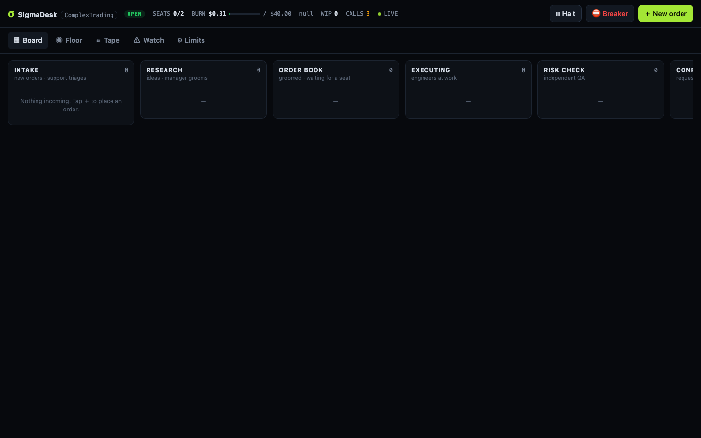

# σ SigmaDesk

**An AI engineering desk run like a quant firm.** Real Claude Code agents sit in real seats — a product manager who
researches competitors, an engineering manager who grooms and staffs work after huddling with principals, principal /
senior / junior engineers, a database engineer, an independent QA, an on-call SRE who reads your production logs, and a
support bot at the front door. You watch all of it live on a Jira-style board from your phone.

Small, risk-limited bets. Everything measured. Nothing ships without an independent risk check — and nothing merges
without you.

| Board | Floor | Watch |
|---|---|---|
|  |  |  |

## What it does

```
 you / GitHub issue ─► Support (triage) ─┐
 PM research (competitors, user pain) ───┼─► Manager grooms ◄─► huddle with principals
 SRE (new recurring error in prod logs) ─┘        │ (size S/M/L/XL, area, risk)
                                                  ▼
                       routed seat: junior (S) · senior (M) · principal (L/XL or high-risk) · DBA (db)
                                                  ▼  own sandboxed clone, commits, `desk submit`
                                            QA risk check (pinned to the submitted commit)
                                                  ▼
                              Confirmation: the seat that asked for it checks it matches its intent
                                                  ▼
                                   branch pushed · draft PR · GitHub issue updated
                                                  ▼
                                              you merge
```

- **One real process per seat.** Every run is `claude -p` with that seat's model (default: principals and the PM on
  `fable`, seniors/manager/DBA/SRE on `opus`, junior and QA on `sonnet`, support on `haiku`) and a charter.
- **Live visibility.** Each run's `stream-json` is turned into human-readable activity ("Reading app/feeds.py",
  "$ pytest …", narration, todo-list progress) and pushed to the UI over SSE. The ticket view is a chat thread; the Floor
  shows every seat's desk, monitor and speech bubble; seats have presence (heads-down, in a meeting, reviewing).
- **Planning meetings are real.** The manager calls `desk consult principal-be "…"`, which runs the principal on the
  spot; the answer lands in the ticket thread for every later seat to read.
- **Requesters review their own asks.** After QA (correctness), the PM / manager / SRE who asked for the work does an
  acceptance review (intent). Rework resumes the engineer's own Claude session in the same clone, so it remembers what
  it tried.
- **On-call SRE.** A deterministic watcher (no LLM) tails Loki / docker / files, fingerprints errors, and wakes the SRE
  only for new or chronic signatures. The SRE files a root-caused bug, mutes noise, or pages you. Error storms become
  one page, not fifty tickets. A fixed signature that comes back reopens as a regression.
- **GitHub is the system of record.** Groomed tickets become issues with status/seat labels; comments mirror; QA-passed
  work becomes a draft PR that closes the issue on merge; merged PRs move tickets to Filled. Issues you label
  `sigmadesk` are imported (from trusted authors only).

## Safety model (read this)

Agents run on your machine, so SigmaDesk treats them as untrusted:

| Layer | What it does |
|---|---|
| **OS sandbox** | Every agent shell runs inside Claude Code's sandbox (Seatbelt on macOS, bubblewrap on Linux) with `allowUnsandboxedCommands: false`: writes only inside the seat's own clone, **no network** (empty allowlist), `~/.ssh`, `~/.aws`, `gh` credentials and your repo's `.env` unreadable. Python/node subprocesses inherit it. |
| **One narrow door** | Agents reach the desk only through a unix socket that exposes agent commands bound to the run's token (role-checked: an engineer cannot pass its own QA). The owner UI is a separate TCP listener that agents cannot reach. |
| **No inherited config** | `--setting-sources ''` (none of your hooks/plugins), `--strict-mcp-config` (no MCP servers), `--tools` limits the toolset, deny rules for `git push`, `gh`, `docker`, `curl`, … |
| **Isolated clones** | Each ticket gets its own local clone (not a worktree — no shared `.git` or hooks). Read-only seats use a scratch clone reset each time. |
| **Publisher, not agents** | Only the desk process pushes branches and opens **draft** PRs, after QA (and acceptance) pass. Nothing is ever merged automatically. |
| **Risk limits** | Per-run budget caps by model, a daily limit with reservations for running seats, max concurrency, an optional quieter "busy window" (e.g. market hours), a halt switch and a circuit breaker that stops every running seat. |
| **Untrusted text** | Ticket bodies, issue bodies, web pages and log lines are fenced and labelled as untrusted data in prompts. Secrets are redacted from the activity log. |

It is still your machine: read the playbook rules, keep `sandbox.enabled: true`, and review every PR.

## Quick start

Requirements: Node ≥ 22.13, git, the [Claude Code CLI](https://code.claude.com) (logged in), and optionally the
GitHub CLI (`gh auth login`). macOS works out of the box; Linux needs `bubblewrap` and `socat` for the sandbox.

```bash
git clone https://github.com/sowmith95/sigmadesk && cd sigmadesk
cp sigmadesk.config.example.json sigmadesk.config.json   # point project.repoPath at your repo
npm run doctor                                           # checks claude, gh, sandbox, config
npm start                                                # http://127.0.0.1:8790
```

No `npm install`: there are zero runtime dependencies (Node's built-in `http`, `node:sqlite`, `child_process`).
The desk starts **halted**; press **Open desk** in the UI when you're ready.

Run it as a service: `scripts/install-service.sh` (launchd on macOS, a systemd user unit on Linux).

### Phone access

Add your Tailscale (or LAN) IP to `server.hosts` and set `server.ownerToken`, then open
`http://<ip>:8790/?token=<ownerToken>` once on the phone (it sets a cookie). Add it to your home screen: it's a PWA.

## Configuration

Everything lives in `sigmadesk.config.json` (gitignored). See `sigmadesk.config.example.json`. Highlights:

| Key | Meaning |
|---|---|
| `project.repoPath`, `githubRepo`, `baseBranch` | The repo the desk works on. |
| `project.playbook` | Markdown every seat reads: how to test, risk rules, product truths. Start from `playbooks/`. |
| `project.copyPaths` | Untracked dirs (e.g. `web/node_modules`) cloned into each workspace (APFS copy-on-write on macOS). |
| `project.extraAllowedBash`, `readOnlyPaths` | E.g. a shared virtualenv the seats may use. |
| `team.<seat>` | Override `name`, `model`, `enabled`, `charter` per seat. |
| `limits.*` | Concurrency, busy window, daily budget, per-run budgets, timeouts. |
| `review.*` | Acceptance reviews, requester session resume (opt-in), rework session resume. |
| `watch.*` | Log sources (`loki` / `docker` / `file`), thresholds, storm and regression handling. |
| `pm.*` | PM persona, competitors to study, cadence. |
| `sandbox.*` | Extra allowed domains (e.g. a package registry) and paths to keep unreadable. |

Live knobs (concurrency, budget, PM cadence, GitHub sync, draft PRs) are also editable in the UI under **Limits**.

## The desk CLI (what agents use)

Agents talk to the desk only through `bin/desk` over the socket: `desk progress 40 "writing tests"`, `desk comment`,
`desk needs-human "<question>"`, `desk propose`, `desk groom`, `desk consult`, `desk submit`, `desk qa pass|fail`,
`desk accept pass|changes`, `desk incident file|mute|page`. Run `bin/desk --help` for the full list.

## Why not fully autonomous merges?

Everything up to a draft PR runs without you. Merging stays human on purpose: in a repo where `main` deploys
production, "the error stopped appearing in the logs" is a gameable success test — an autonomous loop will eventually
ship a silent `except: pass`. The SRE's acceptance review explicitly rejects symptom-hiding fixes, but the final call is
yours.

## Costs

Model spend is reported per run (from Claude Code's own accounting) and summed per seat and per day. On a
subscription this is notional usage that counts against your plan limits; with an API key it is real money. The daily
limit reserves each running seat's full per-run cap, so concurrent runs cannot jointly blow through it.

## Development

```bash
npm test          # node:test, no dependencies
npm run doctor
```

Source map: `src/server.js` (HTTP + SSE + unix socket), `src/scheduler.js` (who picks what up, desk commands),
`src/runner.js` (sandboxed `claude -p` runs, stream parsing, clones), `src/team.js` (seats, routing, permissions,
prompts), `src/watch.js` (log watcher), `src/github.js`, `src/db.js` (SQLite), `public/` (no-build UI).

## License

MIT
