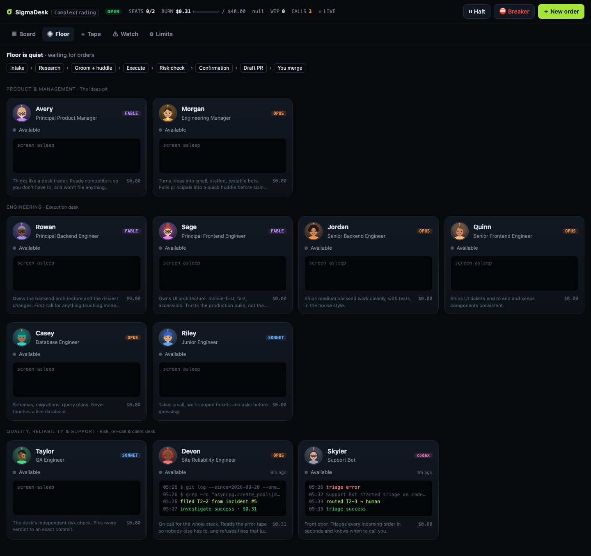
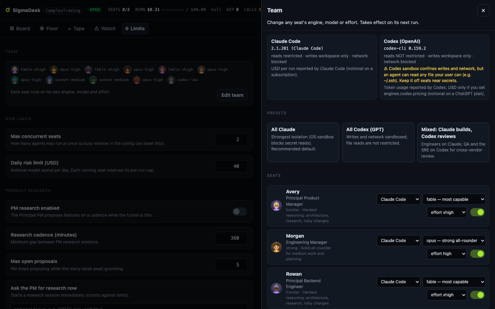
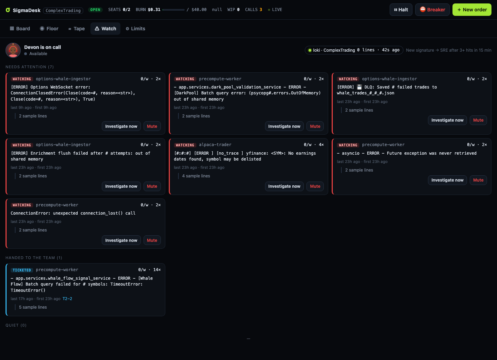
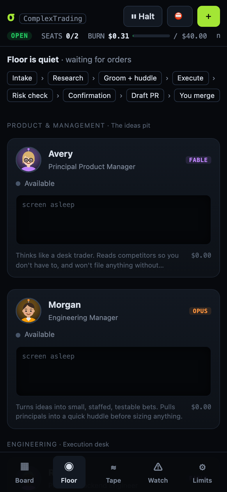
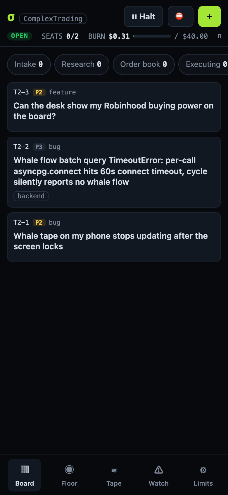

# σ SigmaDesk

**An AI engineering desk run like a quant firm.** Real Claude Code agents sit in real seats — a product manager who
researches competitors, an engineering manager who grooms and staffs work after huddling with principals, principal /
senior / junior engineers, a database engineer, an independent QA, an on-call SRE who reads your production logs, and a
support bot at the front door. You watch all of it live on a Jira-style board from your phone.

Small, risk-limited bets. Everything measured. Nothing ships without an independent risk check — and nothing merges
without you.

| Floor | Team & engines | Watch desk |
|---|---|---|
|  |  |  |

<p align="center"> </p>

## What it does

```
 you / GitHub issue ─► Support (triage) ─┐
 PM research (competitors, user pain) ───┼─► Manager grooms ◄─► huddle with principals
 SRE (new recurring error in prod logs) ─┘        │ (size S/M/L/XL, area, risk)
                                                  ▼
                       routed seat: junior (S) · senior (M) · principal (L/XL or high-risk) · DBA (db)
                                                  ▼  own sandboxed clone, commits, `desk submit`
                                            QA risk check (pinned to the submitted commit)
                                                  ▼
                              Confirmation: the seat that asked for it checks it matches its intent
                                                  ▼
                                   branch pushed · draft PR · GitHub issue updated
                                                  ▼
                                              you merge
```

- **One real process per seat, any engine.** Each seat runs on an engine you choose — **Claude Code** (`claude -p`) or
  **Codex** (`codex exec`, OpenAI GPT models) — with its own model and reasoning effort. The desk detects what is
  installed, suggests a model per seat by capability tier (frontier for principals and the PM, fast/cheap for triage),
  and asks you to confirm the team before it first opens. A "mixed" preset puts QA and the SRE on a different vendor
  than the builders so reviews don't share the author's blind spots.
- **Live visibility.** Each run's `stream-json` is turned into human-readable activity ("Reading app/feeds.py",
  "$ pytest …", narration, todo-list progress) and pushed to the UI over SSE. The ticket view is a chat thread; the Floor
  shows every seat's desk, monitor and speech bubble; seats have presence (heads-down, in a meeting, reviewing).
- **Planning meetings are real.** The manager calls `desk consult principal-be "…"`, which runs the principal on the
  spot; the answer lands in the ticket thread for every later seat to read.
- **Requesters review their own asks.** After QA (correctness), the PM / manager / SRE who asked for the work does an
  acceptance review (intent). Rework resumes the engineer's own Claude session in the same clone, so it remembers what
  it tried.
- **On-call SRE.** A deterministic watcher (no LLM) tails Loki / docker / files, fingerprints errors, and wakes the SRE
  only for new or chronic signatures. The SRE files a root-caused bug, mutes noise, or pages you. Error storms become
  one page, not fifty tickets. A fixed signature that comes back reopens as a regression.
- **GitHub is the system of record.** Groomed tickets become issues with status/seat labels; comments mirror; QA-passed
  work becomes a draft PR that closes the issue on merge; merged PRs move tickets to Filled. Issues you label
  `sigmadesk` are imported (from trusted authors only).

## Engines

| | Claude Code | Codex (OpenAI) |
|---|---|---|
| How it runs | `claude -p --output-format stream-json` | `codex exec --json` with a desk-owned `CODEX_HOME` (apps, plugins, browser/computer use, hooks off) |
| Writes | own clone only (OS sandbox) | own clone only (Codex sandbox) |
| Network | blocked | blocked (permission profile) |
| Secret reads | **blocked** (`~/.ssh`, credentials, desk state) | **blocked** — reads denied outside system/toolchain paths and the clone (Codex permission profiles, beta) |
| Desk transport | per-run unix socket | file mailbox inside the clone |
| Cost | USD per run (notional on a subscription) | tokens; USD if you set `engines.codex.pricing` |
| Resume / fork | both | resume only |

The header shows your Claude plan's 5-hour and 7-day usage (reported by the CLI); new Claude runs pause at
`limits.planHoldAt` (90%) so the desk never eats the headroom you need for your own work. Adding another engine means
implementing one file in `src/engines/` (`command()` + `parse()` → normalized events).

## Safety model (read this)

Agents run on your machine, so SigmaDesk treats them as untrusted:

| Layer | What it does |
|---|---|
| **OS sandbox** | Every agent shell runs inside Claude Code's sandbox (Seatbelt on macOS, bubblewrap on Linux) with `allowUnsandboxedCommands: false`: writes only inside the seat's own clone, **no network** (empty allowlist), `~/.ssh`, `~/.aws`, `gh` credentials and your repo's `.env` unreadable. Python/node subprocesses inherit it. |
| **One narrow door per run** | Each run gets its own unix socket, allowlisted only in that run's sandbox and bound to that run: a token copied from elsewhere is useless. Commands are role- and ticket-checked (an engineer cannot pass its own QA; support can only route the ticket it was given). The owner UI is a separate TCP listener agents cannot reach. |
| **Desk state is invisible** | The desk database, config, private notes and every seat's session transcripts (`~/.claude`, `~/.codex`) are unreadable from agent shells. |
| **Scoped file tools** | Claude's `Edit`/`Write` run outside the Bash sandbox, so they are allowed only under the seat's own clone. Web tools (also outside the sandbox) exist only for the PM's research. |
| **Verdicts can't be forged by code** | QA and acceptance verdicts need a one-time code that lives only in the reviewer's prompt — tests written by the engineer (which QA executes) cannot read it. QA may only pass after its own run executed a test command successfully. |
| **No inherited config** | `--setting-sources ''` (none of your hooks/plugins), `--strict-mcp-config` (no MCP servers), `--tools` limits the toolset, deny rules for `git push`, `gh`, `docker`, `curl`, …; agent shells use plain `bash` (no personal aliases). |
| **Isolated clones** | Each ticket gets its own `--no-hardlinks` clone (no shared `.git`, hooks or object files with your checkout). Read-only seats use a scratch clone reset each time. Clones are deleted when the ticket closes. |
| **Publisher, not agents** | Only the desk pushes, and only the exact commit QA approved (hooks disabled, your remote, not the clone's). PRs are always drafts. Nothing is ever merged automatically. |
| **Publish guard** | Branches touching CI/workflows, Dockerfiles/compose, git hooks, lockfiles or shell scripts — or bigger than the size cap for their complexity — are parked for your explicit approval. An agent-edited workflow would otherwise run on your CI runners with repo secrets. |
| **Risk limits** | Per-run budget caps, a daily limit that reserves every working seat's cap (including jobs still preparing), runs without a final report charged at their cap, max concurrency, a quieter "busy window" (e.g. market hours), an idle watchdog, a halt switch and a circuit breaker that also cancels jobs still preparing. |
| **Untrusted text** | Ticket bodies, issue bodies, web pages and log lines are fenced and labelled as untrusted data in prompts. Secrets are redacted from the activity log. |

It is still your machine: read the playbook rules, keep `sandbox.enabled: true`, and review every PR.

## Quick start

Requirements: Node ≥ 22.13, git, at least one engine — the [Claude Code CLI](https://code.claude.com) and/or the
[Codex CLI](https://github.com/openai/codex) (logged in) — and optionally the GitHub CLI (`gh auth login`). macOS works out of the box; Linux needs `bubblewrap` and `socat` for the sandbox.

```bash
git clone https://github.com/sowmith95/sigmadesk && cd sigmadesk
cp sigmadesk.config.example.json sigmadesk.config.json   # point project.repoPath at your repo
npm run doctor                                           # checks claude, gh, sandbox, config
npm start                                                # http://127.0.0.1:8790
```

No `npm install`: there are zero runtime dependencies (Node's built-in `http`, `node:sqlite`, `child_process`).
The desk starts **halted**; press **Open desk** in the UI when you're ready.

Run it as a service: `scripts/install-service.sh` (launchd on macOS, a systemd user unit on Linux).

### Phone access

Add your Tailscale (or LAN) IP to `server.hosts` and set `server.ownerToken`, then open
`http://<ip>:8790/?token=<ownerToken>` once on the phone (it sets a cookie). Add it to your home screen: it's a PWA.

## Configuration

Everything lives in `sigmadesk.config.json` (gitignored). See `sigmadesk.config.example.json`. Highlights:

| Key | Meaning |
|---|---|
| `project.repoPath`, `githubRepo`, `baseBranch` | The repo the desk works on. |
| `project.playbook` | Markdown every seat reads: how to test, risk rules, product truths. Start from `playbooks/`. |
| `project.copyPaths` | Untracked dirs (e.g. `web/node_modules`) cloned into each workspace (APFS copy-on-write on macOS). |
| `project.extraAllowedBash`, `readOnlyPaths` | E.g. a shared virtualenv the seats may use. |
| `team.<seat>` | Override `name`, `model`, `enabled`, `charter` per seat. |
| `limits.*` | Concurrency, busy window, daily budget, per-run budgets, timeouts. |
| `review.*` | Acceptance reviews, requester session resume (opt-in), rework session resume. |
| `watch.*` | Log sources (`loki` / `docker` / `file`), thresholds, storm and regression handling. |
| `pm.*` | PM persona, competitors to study, cadence. |
| `sandbox.*` | Extra allowed domains (e.g. a package registry) and paths to keep unreadable. |
| `notify.*` | A Discord/Slack webhook or ntfy.sh topic: get pinged when a ticket needs you, a PR is ready, or the SRE pages. |

Live knobs (concurrency, budget, PM cadence, GitHub sync, draft PRs) are also editable in the UI under **Limits**.

## The desk CLI (what agents use)

Agents talk to the desk only through `bin/desk` over the socket: `desk progress 40 "writing tests"`, `desk comment`,
`desk needs-human "<question>"`, `desk propose`, `desk groom`, `desk consult`, `desk submit`, `desk qa pass|fail`,
`desk accept pass|changes`, `desk incident file|mute|page`. Run `bin/desk --help` for the full list.

## How it compares

| | SigmaDesk | [OneManCompany](https://github.com/1mancompany/OneManCompany) | [Citadel](https://github.com/SethGammon/Citadel) | [Vibe Kanban](https://github.com/BloopAI/vibe-kanban) | [CCPM](https://github.com/automazeio/ccpm) |
|---|---|---|---|---|---|
| Target | an existing repo, PR-based | a whole "company", greenfield products | orchestration layer over Claude Code / Codex | kanban for coding agents | PRD → issues → worktrees |
| Roles & routing | 11 seats, area × size × risk routing, principal huddles | hire/fire employees, COO dispatch | — | flat tasks | — |
| OS sandbox by default | ✅ (writes, network, secret reads) | ❌ (runs with permissions skipped) | not a sandbox | git worktrees | git worktrees |
| Independent QA + requester acceptance | ✅ pinned to the commit, evidence-gated | LLM review | judge tiering | — | — |
| On-call SRE from production logs | ✅ deterministic watcher, storms → one page | — | — | — | — |
| Human merge gate | ✅ always | auto-promotes to main | — | — | — |
| Dependencies | zero | Python stack | Node | Rust + Node | markdown |

These projects are good at things SigmaDesk is not (OneManCompany's breadth, Citadel's merge stewardship, Vibe Kanban's
polish). SigmaDesk's bet is narrower: a desk you can leave running against a real codebase on a real machine.

## Roadmap

From a review of the projects above and Microsoft's *AI agents from zero to production* course:
replay evals on your own merged PRs (pick models per seat from data), a red-team seat smoke suite, run provenance
(charter/playbook/model hash per run), desk P&L metrics (merged ÷ shipped, $/merged PR, regressions), owner-approved
lessons memory per seat, ticket dependencies, recurring-defect escalation into playbook fixes, multi-repo desks.

## Why not fully autonomous merges?

Everything up to a draft PR runs without you. Merging stays human on purpose: in a repo where `main` deploys
production, "the error stopped appearing in the logs" is a gameable success test — an autonomous loop will eventually
ship a silent `except: pass`. The SRE's acceptance review explicitly rejects symptom-hiding fixes, but the final call is
yours.

## Costs

Model spend is reported per run (from Claude Code's own accounting) and summed per seat and per day. On a
subscription this is notional usage that counts against your plan limits; with an API key it is real money. The daily
limit reserves each running seat's full per-run cap, so concurrent runs cannot jointly blow through it.

## Development

```bash
npm test          # node:test, no dependencies
npm run doctor
```

Source map: `src/server.js` (HTTP + SSE + unix socket), `src/scheduler.js` (who picks what up, desk commands),
`src/runner.js` (sandboxed runs, evidence, clones, publisher), `src/engines/` (Claude Code, Codex), `src/team.js`
(seats, routing, permissions, prompts), `src/watch.js` (log watcher), `src/github.js`, `src/db.js` (SQLite),
`public/` (no-build UI).

## License

MIT
